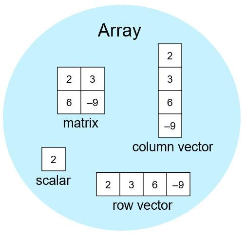

# MATHLAB

## MATLAB Onramp

- MATLAB Commands
- Importing and Visualizing Data
- Projects

*By the end of the course, using MATLAB to analyze the light recoreded from a star to determine if it's movig towards or away from the Earth.*

### NOTES

When you enter a command without a semicolon at the end, MATLAB displays the result.

```m
>> x = 5 + 1
x = 
    6
```

Optionally, you can add a semicolon to the end of a command so that the result is not displayed. MATLAB still executes the command, and you can see the variable in the Workspace browser.

```m
>> x = 5 + 1;
```

---

## Run Script

### Task One

```m
r = 0.5
```

Calculate Area

```m
x = pi*r^2
```

Calculate Circumference

```m
y = 2*pi*r
```

## What's an Array?

All MATLAB variables are arrays. So, each numeric variable can contain multiple numbers. You can store related data in one variable by using an array.
Because arrays are a basic programming tool in the MATLAB language, it's important to get to know them and the terminology used to describe them.



### Manually Enter Arrays

Instructions are in the task pane to the left. Complete and submit each task one at a time.

### Task 1

In MATLAB, a single number, called a scalar, is represented by a 1-by-1 array, meaning the array contains one row and one column.

**Task**  Create a variable named x with a value of 4.

``` m
x = 4
```

### Task 2

You can create arrays with multiple elements using square brackets.

```m
x = [3 5]
x =
3    5
```

**Task** Create an array named y with two elements: 7 and 9

```m
y = [7 9]
```

### Task 3

When you separate numbers by using spaces as shown in the previous task, MATLAB combines the numbers into a row vector, which is an array with one row and multiple columns (1-by-n). When you separate numbers by using semicolons, MATLAB creates a column vector (n-by-1).

```m
x = [1;3]
x =
1
3
```

**Task** Create an array named z with two elements, 7 and 9, in a single column.
Try copying the previous command and changing the space between the numbers to a semicolon (;).

```m
z = [7;9]
```

### Task 4 - Row Vector

**Task** Create a row vector named a that contains the values 3, 10, and 5 in that order.

```m
a = [3 10 5]
```

### Task 5 - Column Vector

**Task** Create a column vector named b that contains the values 8, 2, and -4 in that order.

```m
b = [8;2;-4]
```

### Task 6 - Matrix

You can use a combination of spaces and semicolons to create a matrix, which is an array with multiple rows and columns. When creating a matrix, you enter the elements row by row.

```m
x = [3 4 5; 6 7 8]
x =  
3    4    5    
6    7    8
```

**Task** Create a matrix named c with these values.

```m
5    6    7
8    9   10

c = [5 6 7; 8 9 10]
```

### Task 7

You can perform calculations within the square brackets.

```m
x = [abs(-4) 4^2]
x =   
4    16
```

**Task** Create a row vector named d that contains sqrt(10) as the first element and pi^2 (π^2) as the second element.

```m
d = [sqrt(10) pi^2]
```

### Further Practice

Arrays are a common data structure used throughout MATLAB. In fact, MATLAB is an abbreviation for MATrix LABoratory. Most MATLAB functionality can work on multiple values at once.
MATLAB provides some flexibility for creating arrays. For example, these commands are all valid ways to create the same array.

```m
x = [7 9]
x=[7,9]
x = [7, 9]
matrix = [7 1 8; 4 5 8; 10 4 2]
```


